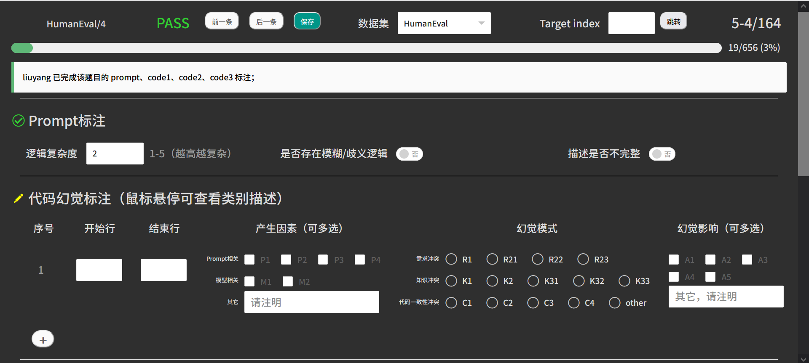

## 打开方式
浏览器直接打开[label-tool.html](./label-tool.html)即可
> 建议使用Firefox浏览器（未对其他浏览器进行兼容性测试）

> 将浏览器缩放调整至90%（或更低），使得页面显示效果如下：
> 

## 界面及功能说明（从上到下，从左到右）

> 在第一次打开页面时会提示输入用户名，请使用自己姓名的拼音

### 任务信息栏
1. 任务/题目ID
2. 代码评测情况（PASS or FAIL）
3. 三个按钮（切换到前一条数据（快捷键shift+左方向键）、切换到后一条数据（快捷键shift+右方向键）、保存标注结果（快捷键shift+下方向键））
    > 数据切换逻辑：
    >> 切换数据时，优先在同一个任务内部的不同生成数据之间切换（如对于大小为164的HumanEval，下标为1-1的数据通过“后一个”按钮切换到下标为1-2）
    >
    >> 向后切换时，如果一个任务内部的所有生成已经遍历完毕，则切换到下一个任务的第一个生成数据（向前切换同理） 

4. 数据集选择
5. 目标下标跳转（示例输入：1-1）
6. 当前任务下标-任务内部数据下标/数据集总大小（下标均从1开始）

### 标注进度提示

- 自己所需要标注数据的标注进度
- 当前题目的全局标注情况

### Prompt标注栏

> 对于还没有被自己标注的prompt，“Prompt标注”前面会有一个黄色的标识，如果已经标注则是一个绿色的对勾，代码幻觉标注栏也一样。

1. prompt逻辑复杂度标注
2. prompt是否存在模糊/歧义逻辑（若选是则会出现详细信息框）
3. prompt的描述是否不完整

### 代码幻觉标注栏
> 一条数据可以标注多处幻觉，点击底部'+'号以添加一条新的标注

1. 开始和结束行（使用**模型原始响应**中的行数）
2. 产生因素（可多选）
3. 幻觉模式（单选，所有14个选项中只能选一个，**最后的other是所有选项的other，而非“代码一致性冲突”的other**）
    > 对于“产生因素”和“幻觉模式”，当选择“其它”时，请以“子类别-描述“的形式给出，如”知识冲突-XXX“
4. 幻觉影响（可多选）

### 数据详细信息
1. 任务prompt
2. 模型原始响应（未经过代码提取）
3. 任务参考代码
4. 从模型响应中提取出的代码（不一定提取正确，一切以模型原始响应为准）
5. 错误信息（仅供参考，评测不一定准确；CoderEval-Python没有错误信息）
